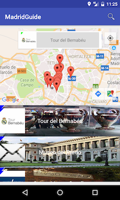

#MadridGuide

MadridGuide es una aplicación Android que permite descargar tiendas y actividades a realizar en Madrid para luego consultar sin necesidad de conexión a Internet.

Cuando arranca la aplicación aparecen dos botones: Tiendas y Actividades


Al pulsar cualquiera de los dos botones aparece una pantalla dividada en dos partes. En la parte superior el mapa donde aparecen las tiendas o las actividades y en la parte inferior la lista de tiendas y actividades.


Si se toca en cualquiera de los pins aparecerá un bocadillo con el nombre de la actividad o tienda.



Cuando se pulsa sobre un bocadillo o sobre un elemento de la lista de actividades o tiendas aparece una pantalla con más información de la tienda o actividad.


### Herramientas utilizadas

Para el desarrollo de MadridGuide se han utilizado las siguientes herramientas:

- [AndroidStudio 2.2.3] (https://developer.android.com/studio/index.html)
- [Picasso] (http://square.github.io/picasso/)
- [ButterKnife] (http://jakewharton.github.io/butterknife/)
- [Volley] (https://developer.android.com/training/volley/index.html)
- [Gson] (https://github.com/google/gson)

### Antes de compilar

Antes de compilar el proyecto hay que crear el fichero config.xml con el api key de google. El fichero tendrá el siguiente formato:

````
<resources>
    <string name="google_maps_api_key">Api key</string>
</resources>
````

### Descarga del apk

[MadridGuide] (https://drive.google.com/open?id=0B5B4UUgctCk4a1d3MlU4cVlYNnM)